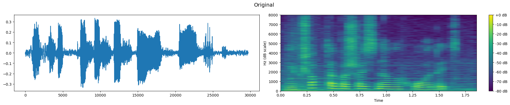
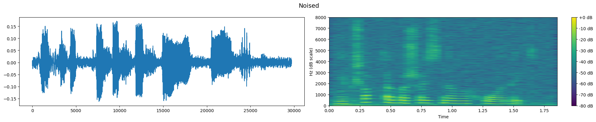
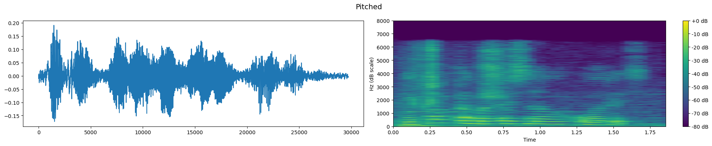
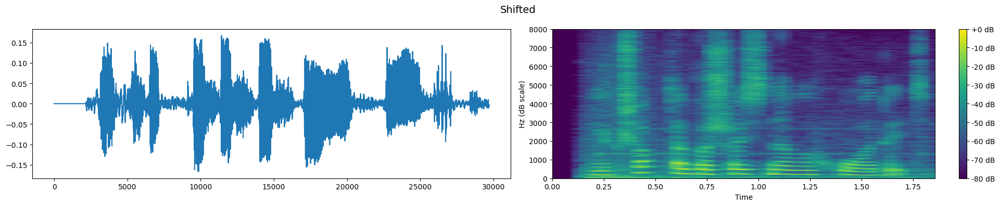
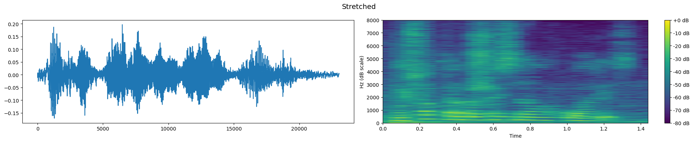
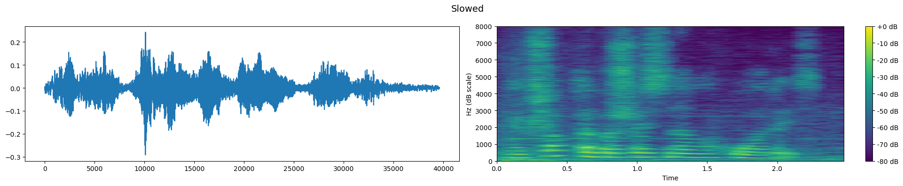
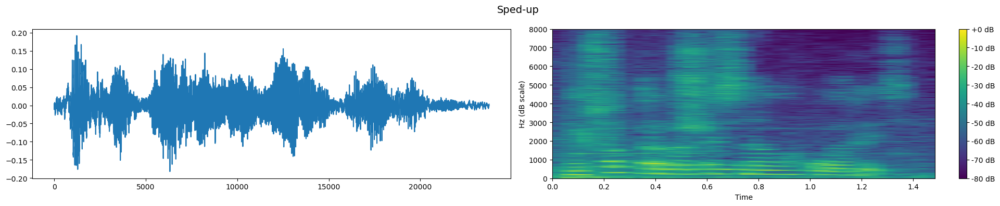

# Assignment 1

Yevhenii Zasko & Oleh Kovalyshyn

## Exploratory Data Analysis

Ukrainian Emotion Recognition (UER) Dataset consists of 952 audio clips by 400 speakers spanning from less than 1 second to almost 6 seconds each. The samples were collected from YouTube videos, supposedly, Ukrainian TV programmes. Four emotions labeling was performed by 3 native experts based on majority vote. Transcription of the clips was performed using Google Gemini.

The dataset is predominantly female, featuring 593 female speakers compared to 359 male. Overall emotional distribution is even, with angry (259) and happy (244) clips being slightly more prevalent than neutral (222) and sad (227). Distribution of samples duration is similar between male and female speakers. Distribution of number words for each duration is linear-ish, suggesting appropriate clipping with no big speech pauses. These numbers are visualized in _Fig. 1_.

  
   
  <em>Figure 1. UER Dataset visualization, train and test mixed.</em>

An interesting observation from this visualization is unevennes of emotional distribution when additionally split by gender. There are very few (40) male sad samples compared to female sad (187). Similar relation holds for happy samples where female speakers (171) strongly dominate male ones (73). On the other hand, number of neutral samples in male speakers (128) is third as high as in female (94). This suggest it might be difficult for machine/deep learning approaches to pick exact emotional signatures for some emotions as they could give much more meaning, than needed in reality, to such parameters as sex. Correction for this is necessary when designing test/validation split.

We additionally explored the existing train/test split created by the dataset author (_Fig. 2_). Train fold features 771 samples compared to 181 in test. Test is much more gender balansed with 98 female samples vs 83 male. Female neutral and male happy samples are underrepresented (8 and 7 samples respectively) in test meaning it can be hard to evaluate real learning performance on these emotion-gender combinations. We also validated the author's claim that speakers appearing in the train split are not included in the test split.

  
  
   
  <em>Figure 2. UER Dataset visualization, split by test & train</em>

## Validation Strategy & Metric Selection

$\color{red}{\text{TODO}}$

## Preprocessing

### Normalization
To normalize samples we utilized two-step approach. First, we normalized samples with RMS norm with the subsequent application of peak normalization. RMS normalization allows to equalize loudness across the whole sample, in a way that outlier peaks (samples much louder than the average) don't influence the overall result. Target RMS value for this procedure was calculated as mean RMS across the all un-normalized samples in the dataset.

Peak-normalization and [-1; 1] clipping was applied on RMS-normalized dataset to reduce possible remainin loudness inequalities.

### Dataset Augmentation

Next we explored options to extract most information from the limited number of train samples while avoid overfitting. For that, we performed train dataset augmentation as decribed in a strange Indian paper of questionable quality [1].

For each sample we performed: (1) noising, (2) pitch shift, (3) time stretch, (4) time shift, (5) slow-down, (6) speed-up. This resulted into six synthetic samples for each original one. Original and synthetic samples composed the input dataset for subsequent training.

Noising was performed applying a value samples from Standard Normal distribution for each frame, scaled to the loudest frame and multiplied by the noise rate coefficient (0.035).

Pitch shift was performed using librosa function `pitch_shift` with number of steps determined randomly from the shift range [-3; 3].

Time stretch was performed using librosa function `time_strech` with rate randomly determined from the range [1.1; 1.5].

Slow-down and speed-up was performed using librosa function `time_stretch` with fixed rate of 25%.

Time shift was performed by shifting all samples by a random value between -10% and 10% and padding the freed space with zeros.

After each augmentation, the resulting synthetic sample was normalized as described before. Specific values for augmentation parameters were determined from researcher intuition, conversations with AI, experimentation, or revealed in a dream. Example of the augmented sample is seen on _Fig. 3_.

  
   
  
   
  
   
  
   
  
   
  
   
  
   
  <em>Figure 3. Different augmentations of the same sample. Waveform and spectrogram (dB) representation</em>

### Feature Extraction

Following features were extracted for each sample for the classification task using machine learning methods: (1) means of 20  Mel-Frequency Cepstral Coefficients (MFCC), (2) standard deviations of 20 MFCC, (3) fundamental frequency (F0), (4) mean Root-Mean Square value (RMS), (5) mean Zero-Crossing Rate (ZCR).

## Classification With Spectral Features

## Classification With Deep Learning Approaches

$\color{red}{\text{TODO}}$

## Conclusion

$\color{red}{\text{TODO}}$

## References

1. S. K. Panda, A. K. Jena, M. R. Panda, and S. Panda, “Speech emotion recognition using multimodal feature fusion with machine learning approach,” Multimedia Tools and Applications, Apr. 2023, doi: https://doi.org/10.1007/s11042-023-15275-3.
‌