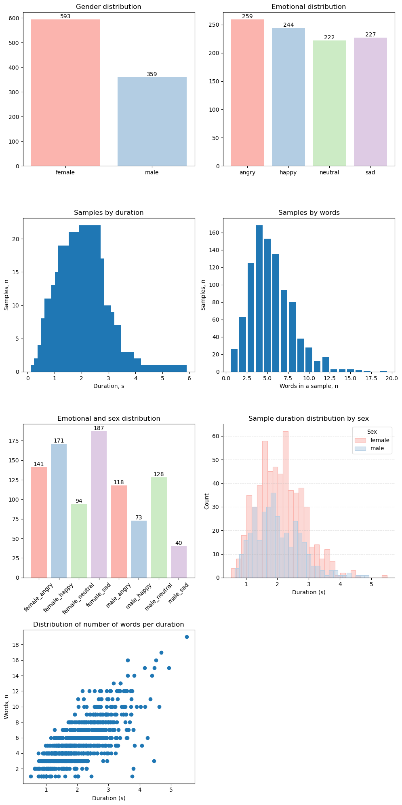
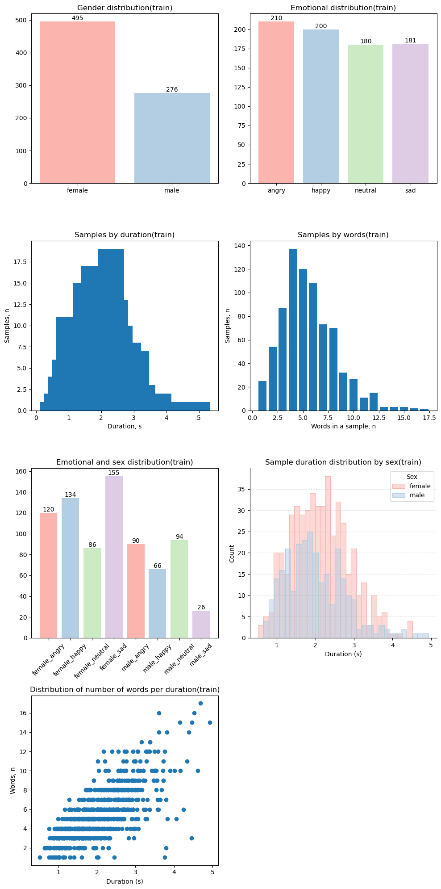
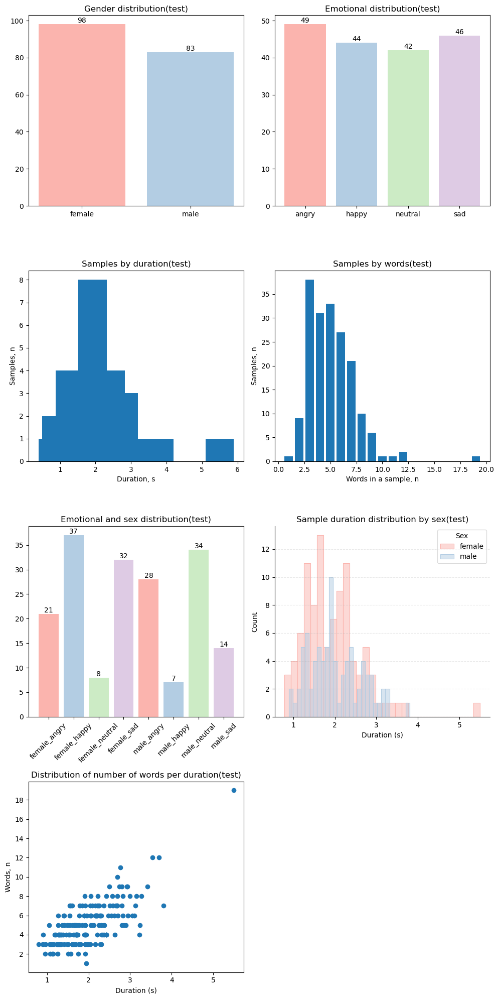

# Assignment 1

Yevhenii Zasko & Oleh Kovalyshyn

## Exploratory Data Analysis

Ukrainian Emotion Recognition (UER) Dataset consists of 952 audio clips by 400 speakers spanning from less than 1 second to almost 6 seconds each. The samples were collected from YouTube videos, supposedly, Ukrainian TV programmes. Four emotions labeling was performed by 3 native experts based on majority vote. Transcription of the clips was performed using Google Gemini.

The dataset is predominantly female, featuring 593 female speakers compared to 359 male. Overall emotional distribution is even, with angry (259) and happy (244) clips being slightly more prevalent than neutral (222) and sad (227). Distribution of samples duration is similar between male and female speakers. Distribution of number words for each duration is linear-ish, suggesting appropriate clipping with no big speech pauses. These numbers are visualized in _Fig. 1_.

  
   
  <em>Figure 1. UER Dataset visualization, train and test mixed.</em>

An interesting observation from this visualization is unevennes of emotional distribution when additionally split by gender. There are very few (40) male sad samples compared to female sad (187). Similar relation holds for happy samples where female speakers (171) strongly dominate male ones (73). On the other hand, number of neutral samples in male speakers (128) is third as high as in female (94). This suggest it might be difficult for machine/deep learning approaches to pick exact emotional signatures for some emotions as they could give much more meaning, than needed in reality, to such parameters as sex. Correction for this is necessary when designing test/validation split.

We additionally explored the existing train/test split created by the dataset author (_Fig. 2_). Train fold features 771 sample compared to 181 in test. Test is much more gender balansed with 98 female samples vs 83 male. Female neutral and male happy samples are underrepresented (8 and 7 samples respectively) in test meaning it can be hard to evaluate real learning performance on these emotion-gender combinations.

  
  
   
  <em>Figure 2. UER Dataset visualization, split by test & train</em>

## Validation Strategy & Metric Selection

$\color{red}{\text{TODO}}$

## Preprocessing

## Classification With Spectral Features
